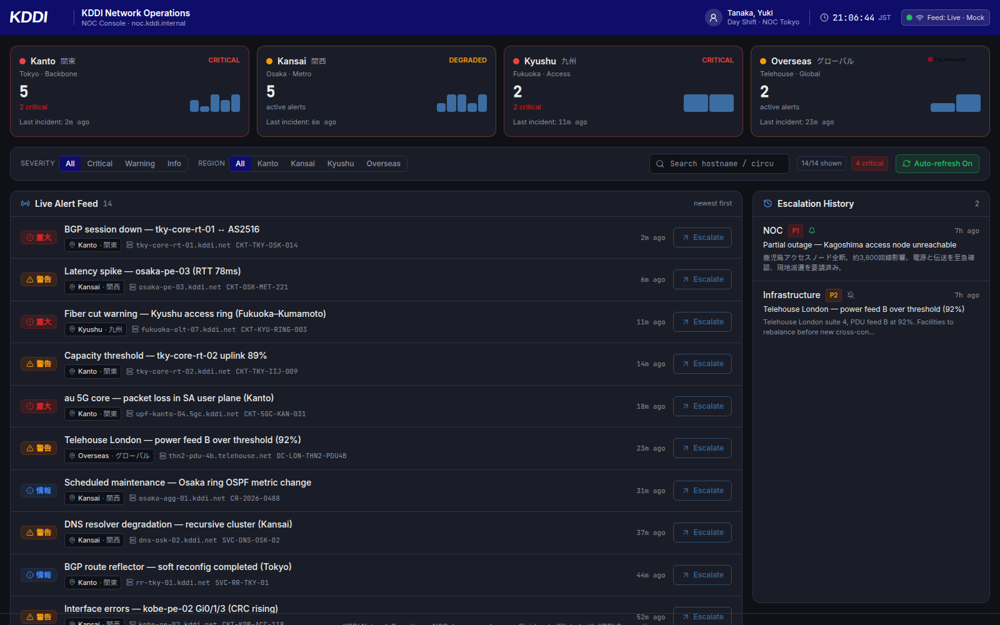

# KDDI Network Operations Status Dashboard

An internal-looking **NOC (Network Operations Center)** console for KDDI's backbone, mobile,
and Telehouse data-center operations. It shows a regional status bar, a live alert feed, an
escalation workflow, an escalation history panel, and an alert detail drawer.

> ⚠️ **Disclaimer — unofficial demo.** This project is **not affiliated with, endorsed by, or
> connected to KDDI Corporation or Telehouse.** It is a UI/UX fidelity demo built for live agent
> workflows. All data is **dummy data**, there are **no real integrations**, and the brand marks
> are **recreations** used solely for visual fidelity (see [Brand assets](#brand-assets)).



---

## Highlights

- **Dark ops-console UI** with KDDI Blue (`#0E0D6A`) branding and a Datadog/Grafana-style density.
- **Regional status bar** — Kanto / Kansai / Kyushu / Overseas (Telehouse) health cards, derived
  live from the current alert set.
- **Live alert feed** — realistic Japanese telecom events (BGP flaps, latency spikes, fiber cuts,
  5G core packet loss, Telehouse capacity, DNS degradation…) with bilingual severity badges
  (`重大 / 警告 / 情報`), monospace hostnames/circuit IDs, and JST timestamps.
- **Simulated live feed** — a new synthetic alert is prepended every 45s (toggle in the toolbar).
- **Escalation flow** — team picker (with on-call capacity hints), priority (P1/P2/P3), required
  note, and a "notify team channel" action (mocked via toast). Persisted to `localStorage`.
- **Escalation history** + **alert detail drawer** (metric sparkline, affected nodes, related
  alerts, collapsible raw JSON).

### 🎬 The assignee field is intentionally stubbed

The escalation modal is **fully wired except for the Assignee field**, which is a visible,
disabled placeholder (`AssigneePlaceholder.jsx`) with the helper text
*"Assignee selection — to be added in live demo."* It is **not** part of component state and is
**never** included in the submitted payload. A matching `// TODO(live-demo): wire assignee picker`
comment marks the spot in `EscalateModal.jsx`. This is the gap a live agent demo fills in real time.

---

## Prerequisites

- **Node 20+** (developed on Node 22) and npm 10+.

## Setup

```bash
npm install
npm run dev      # → http://localhost:5173
```

## Scripts

| Script              | Description                                       |
| ------------------- | ------------------------------------------------- |
| `npm run dev`       | Start the Vite dev server on port 5173            |
| `npm run build`     | Production build to `dist/`                        |
| `npm run preview`   | Preview the production build                       |
| `npm test`          | Run the Vitest + React Testing Library suite      |
| `npm run test:watch`| Run tests in watch mode                           |
| `npm run lint`      | ESLint (flat config)                              |
| `npm run format`    | Prettier write                                    |

---

## Demo walkthrough

1. **Open the app** — the browser tab shows the KDDI favicon; the header shows the KDDI logo on the
   brand-blue bar with a live JST clock and a "Feed: Live · Mock" indicator.
2. **Scan regional health** — the four status cards turn amber/red as critical and warning alerts
   accumulate per region (health is derived from the alerts, not hard-coded).
3. **Filter the feed** — use the severity/region segmented filters and the hostname/circuit search.
   Toggle **Auto-refresh** to start/stop the simulated live feed.
4. **Open an alert** — click a row body to open the detail drawer (description, metric sparkline,
   affected nodes, related alerts, raw JSON).
5. **Escalate** — click **Escalate** on a row (or in the drawer). Pick a team and priority, write a
   note (≥10 chars), and submit. A success toast confirms `Escalated to {team} · {priority}`, the
   row shows an **Escalated** chip, and the **Escalation History** panel updates.
6. **Note the missing Assignee field** — it is present but disabled, ready to be wired live.

---

## Project structure

```
src/
  App.jsx                  # composition: shell → status bar → toolbar → feed | history
  index.css                # Tailwind v4 @theme tokens (KDDI + NOC palette) + fonts
  components/
    layout/    AppShell, Header (KDDI logo + live JST clock)
    status/    StatusBar, RegionCard
    alerts/    AlertFeed, AlertRow, AlertDetailDrawer, SeverityBadge, RegionTag
    escalation/EscalateModal, EscalateButton, TeamSelector, PrioritySelector,
               AssigneePlaceholder (stub), EscalationHistory
    toolbar/   Toolbar, FilterGroup
    ui/        Button, Badge, Modal, Toast, ToastViewport, Select, Textarea,
               EmptyState, LoadingSkeleton, Sparkline
  context/     EscalationContext, ToastContext
  data/        mockAlerts, mockRegions (derived health), teams, alertTemplates
  hooks/       useAlerts, useEscalations, useAutoRefresh, useClock, useFocusTrap
  lib/         storage, formatters, constants, cx
  test/        Vitest + RTL suites
data/escalations.json      # seed escalations (used on first load)
public/brand/              # logos, favicon, brand-assets.json manifest
scripts/fetch-brand-assets.sh
```

## How escalation persistence works

Escalations live in React context (`EscalationContext`). On first load the context hydrates from
`localStorage` key **`kddi-noc-escalations`**, falling back to the committed `data/escalations.json`
seed when nothing is stored. Every change is written back to `localStorage`.

The persisted record shape is:

```js
{ id, alertId, team, priority, note, notify, createdAt, alertSnapshot }
```

There is **no `assignee` field** yet — the schema is additive, so a future assignee picker can add
the key to new records with no migration.

**Re-escalation policy:** an already-escalated alert can be escalated again, but only after a
`window.confirm()` prompt. Escalated rows show a green **Escalated** chip.

## Brand assets

The brand fetcher `scripts/fetch-brand-assets.sh` downloads official KDDI/Telehouse assets into
`public/brand/`. In this repo's build sandbox those domains are unreachable (network allowlist), so
the committed logos/favicon are **faithful recreations** documented in
[`public/brand/brand-assets.json`](public/brand/brand-assets.json) with `status: "recreated-fallback"`.
Run the script in a networked environment to replace them with official files, then update the
manifest. All assets are self-hosted under `/brand/` — there are no external hotlinks.

---

## 🎤 Live demo script (suggested agent prompts)

These prompts are designed to show a multi-file agent edit on stage:

1. **Add the assignee picker** —
   *"In `EscalateModal.jsx`, replace `<AssigneePlaceholder />` with a working assignee dropdown.
   Add `assignee` to the form state, populate options from a new `src/data/operators.js`, include
   `assignee` in the submit payload and the persisted record, and show it in `EscalationHistory`."*
2. **Center the modal** —
   *"Make the escalation modal vertically centered on all viewport sizes."*
3. **Surface team capacity in the dropdown** —
   *"Show each team's on-call capacity inline in the assignee/team selector and disable teams with
   no available slots."*

## Known limitations

- Mock data only — no real network feeds, SNMP, BGP, or telemetry.
- No authentication (an internal tool assumed to live behind a VPN).
- **No assignee selection** — intentionally stubbed for the live demo.
- Persistence is `localStorage` only (no backend/database).
- Brand assets are recreations (official downloads blocked in the build sandbox).
